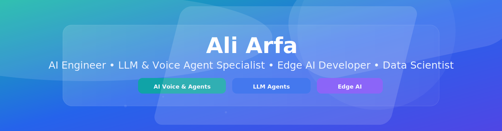
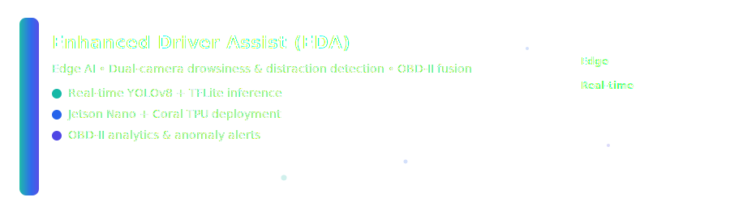
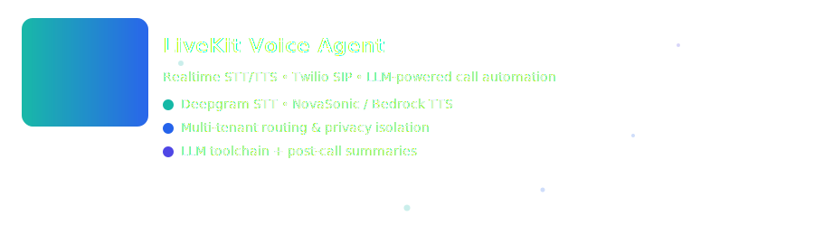
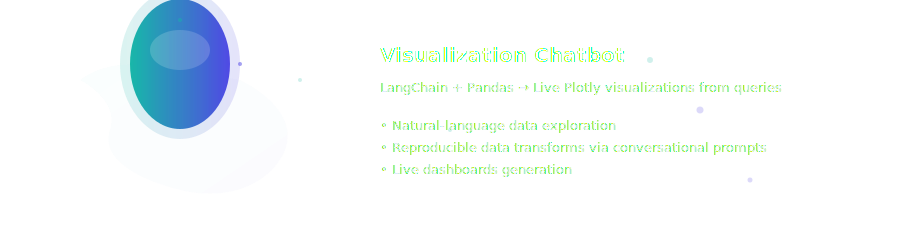

<!-- ========================= -->
<!--   PORTFOLIO BANNER        -->
<!-- ========================= -->

  

<!-- ========================= -->
<!--     ABOUT SECTION         -->
<!-- ========================= -->

## ✨ About Me

I build **real-time AI systems** across **LLMs**, **voice agents**, **multimodal pipelines**, and **edge computing**. My work ranges from **production-grade AI voice systems** to **Jetson-powered driver safety intelligence**, with a focus on **fast, efficient, deployable models**.

**🏅 3× Gold Medalist** — National AI Competitions | **🏅 2× Runner-Up** — AI Product Innovation  
⚡ Specializing in autonomous agents, inference optimization, and embedded intelligence.

<!-- ========================= -->
<!--      SKILLS SECTION       -->
<!-- ========================= -->

## 🛠️ Core Skills

  

<!-- ========================= -->
<!--     FEATURED PROJECTS     -->
<!-- ========================= -->

## 🚀 Featured Projects

  

<!-- Fallback text for EDA (uncomment if SVG doesn't load):
### 🛣️ **Enhanced Driver Assist (EDA)**  
**Edge AI • Jetson Nano • Computer Vision • OBD-II Fusion**
- Real-time YOLOv8 + TFLite inference
- Jetson Nano + Coral TPU deployment
- OBD-II analytics & anomaly alerts
- Dual-camera drowsiness & distraction detection
🔗 **Website:** https://eda-kdd.netlify.app/
-->

  

<!-- Fallback text for LiveKit (uncomment if SVG doesn't load):
### 🎙️ **LiveKit Voice Agent (Production-Ready)**  
**LLM Voice AI • Multi-Tenant • Realtime Streaming**
- Twilio SIP + LiveKit bidirectional audio
- Deepgram STT + Bedrock NovaSonic TTS
- Automated call summaries + structured outputs
- Custom tools (DB access, routing, context manager)
- Multi-tenant isolation with full logging pipeline
-->

  

<!-- Fallback text for Visualization Chatbot (uncomment if SVG doesn't load):
### 📊 **Visualization Chatbot**  
**LangChain • Pandas • Plotly • Natural Language Processing**
- Natural-language data exploration
- Reproducible data transforms via conversational prompts
- Live dashboards generation
- Real-time Plotly visualizations from queries
-->

  

<!-- Fallback text for Mulazmat (uncomment if SVG doesn't load):
### 🧠 **Mulazmat — AI Resume Parser (NCAI-funded)**  
**BERT • NLP • Edge AI • Production Optimization**
- BERT-based parser for skill extraction
- Job-candidate ranking system
- Optimized for production + edge inference
- Rule-based and ML hybrid pipeline
-->

<!-- ========================= -->
<!--     STATS SECTION         -->
<!-- ========================= -->

## 📊 GitHub Analytics

<table>
<tr>
<td width="50%">

</td>
 

</td>
</tr>
</table>

## 🌐 Connect

 

  

