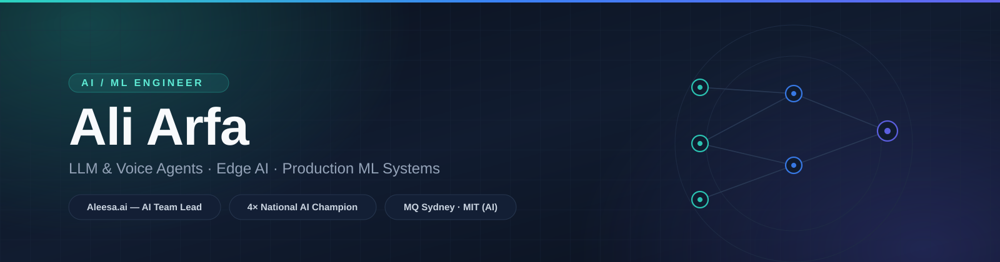
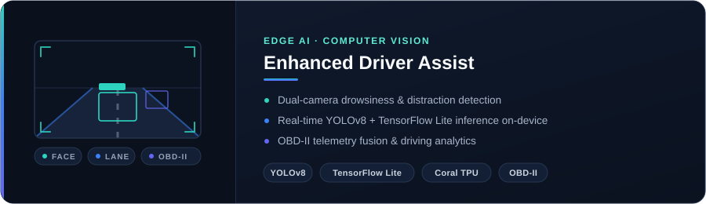
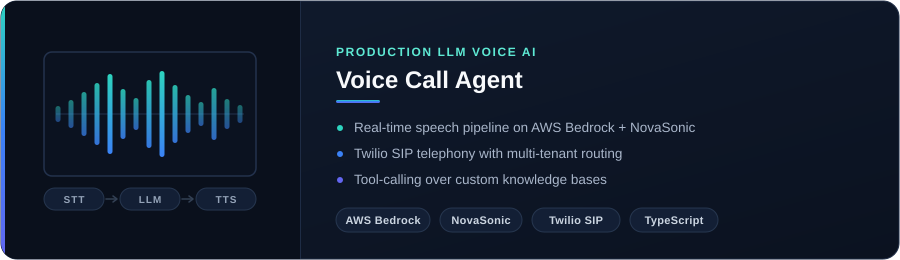
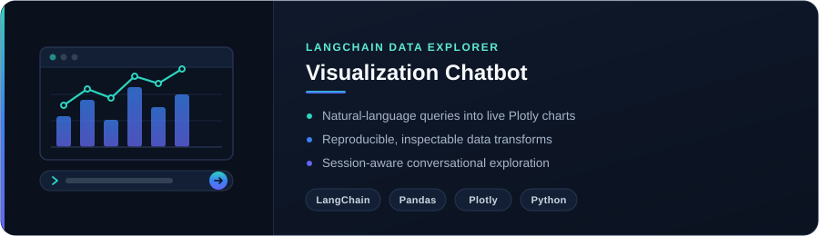
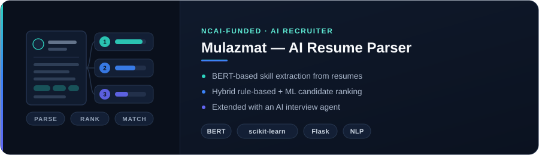

---

## About

I'm an **AI/ML Engineer & Builder** who ships **production AI systems end-to-end**. My expertise spans:

- **Real-time voice agents** with 24/7 uptime & multi-tenant architecture
- **LLM agents** with tool-calling and agentic orchestration
- **Production RAG pipelines** with knowledge base integration
- **Edge AI** on constrained hardware (Raspberry Pi, Coral TPU, Jetson Nano)
- **Computer vision** systems for real-world deployment
- **Full-stack AI infrastructure** from inference to deployment

I lead **AI development at Aleesa.ai** — an AI-driven business communication platform in production — and previously led research & engineering at FAST-NUCES' KDD Lab. I've won **4 national AI competitions** including the **Gold Medal** at DAIRA AI Track.

**Currently:** Master of IT (Artificial Intelligence) · Macquarie University, Sydney

---

## Technical Stack

**Languages:** Python · TypeScript · C++ · C · SQL · Bash  
**ML/AI:** PyTorch · TensorFlow · LangChain · Hugging Face · YOLOv8 · OpenCV · scikit-learn  
**Cloud & DevOps:** AWS Bedrock · Lambda · Docker · FastAPI · Flask · CI/CD  
**Data & Databases:** Pandas · NumPy · Plotly · MongoDB · MySQL · Redis  
**Edge & Hardware:** Raspberry Pi · Coral TPU · Jetson Nano · OBD-II · Model Quantization  
**Voice & Communications:** Twilio · NovaSonic · Cartesia · SMS · WhatsApp · Telephony APIs

---

## Flagship: Aleesa.ai

**AI Team Lead** | *Sep 2025 — Present*

I lead AI development of an **AI-driven business communication platform** in production. The system unifies voice, messaging, and CRM into a low-latency architecture handling enterprise operations at scale.

**Core capabilities:**
- Real-time voice agents (inbound, outbound, call handling)
- Omnichannel messaging (SMS, WhatsApp, email)
- Integrated CRM with lead management & workflow automation
- Calendar sync with intelligent confirmation triggers
- Custom knowledge bases & contextual reasoning

**Technical approach:** AWS Bedrock + NovaSonic · Async TypeScript APIs · Twilio · 24/7 uptime

---

## Featured Projects

### Enhanced Driver Assist (EDA) — 4× Competition Winner

Edge AI system for real-time driver safety monitoring on affordable hardware. Detects drowsiness, distraction, and lane departure through dual-camera computer vision; integrates OBD-II for driving analytics.

**Recognition:** Gold Medal (DAIRA AI Track) · 1st Place (COMPEC'25) · 1st Place (ExcITe Cup'25)

**Tech:** YOLOv8 · TensorFlow Lite · OpenCV · MediaPipe · Raspberry Pi · Coral TPU · OBD-II  
**[View Project →](https://eda-kdd.netlify.app/)**

---

### Voice Call Agent — Production LLM Voice AI

Production-ready AI voice agent with sub-100ms latency. Powers Aleesa.ai with natural, expressive voice responses; integrates custom knowledge bases and intelligent tool-calling for context-aware interactions.

**Features:** NovaSonic + AWS Bedrock · Custom knowledge bases · Async TypeScript APIs · Twilio SIP · Multi-tenant architecture  
**Tech:** AWS Bedrock · Twilio · TypeScript · LLM Agents

---

### Visualization Chatbot — LangChain Data Explorer

LangChain agent that transforms natural-language queries into live data visualizations. Enables conversational data exploration with reproducible transforms and interactive Plotly dashboards.

**Features:** Natural-language data exploration · Real-time visualizations · Reproducible workflows · Session management  
**Tech:** LangChain · Pandas · Plotly · Python

---

### Mulazmat — AI Resume Parser (NCAI-funded)

AI recruiter platform for candidate–job matching and skill extraction. Combines BERT-based parsing with rule-based NLP and ML for intelligent ranking; extended with AI interview agent.

**Impact:** Led 5-member team on platform development and AI integration  
**Features:** BERT skill extraction · Job-candidate ranking · Production optimization · AI interview agent  
**Tech:** BERT · scikit-learn · Flask · NLP

---

### RAG-PDF Chatbot

Knowledge-base chatbot using LangChain and vector embeddings. Provides contextual Q&A over PDF datasets with semantic search and retrieval-augmented generation.

**Tech:** LangChain · FAISS · ChromaDB · RAG · Python

---

## Experience

**AI & Data Science Associate · AI Team Lead** | Aleesa.ai (TechOptionz) | *Sep 2025 — Present*  
Led AI development of production voice + CRM platform; architected low-latency telephony + LLM stack; shipped 24/7 live service.

**Research Assistant & Project Lead** | KDD Lab, FAST-NUCES (NCAI-funded) | *Mar 2023 — Jun 2025*  
Led 5-member team on AI recruiter platform; pioneered LLM agents for task orchestration; delivered Enhanced Driver Assist (4× competition winner).

---

## Education

**Master of IT — Artificial Intelligence** | Macquarie University, Sydney | *2026 — Present (Expected 2028)*

**BSc in Data Science** | FAST – National University of Computer and Emerging Sciences, Islamabad | *Aug 2021 – Jun 2025*

---

## Recognition & Awards

| Award | Competition | Details |
|:------|:------|:--------|
| 🥇 Gold Medal | DAIRA AI Track | FAST-NUCES, Faisalabad |
| 🥇 1st Place | COMPEC'25 | IoT & Digital Technologies — NUST CEME, Islamabad |
| 🥇 1st Place | ExcITe Cup'25 | Project Exhibition — CUST, Islamabad |
| 🥈 Runner-up | NASCON'25 | NumAIsh — FAST-NUCES, Islamabad |
| 🥈 Runner-up | SOFTEC'25 | AI Product Innovation — FAST-NUCES, Lahore |

---

## GitHub Stats

  
  

---

## Get in Touch

**Open to roles in AI/ML engineering, applied AI product, and data science.**

---

